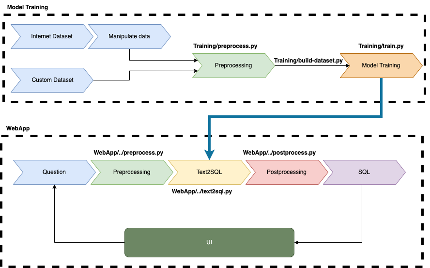

[](https://colab.research.google.com/drive/1QIOEfsB7DPcPRp9VX3fK2yg6atybkHvq#scrollTo=Bsy56wuXOPg1)

# TechChallenge #1: Writing SQL without Knowing SQL

> by tsdocode from CoE



## Resources

Use KMS email to access resources

[Pretrained model](https://drive.google.com/drive/folders/11aWe3IZ0pfxujwzsFHwSzgJuAlPryBNs?usp=sharing)

[Sample Dataset](https://drive.google.com/drive/folders/1eQ6T2AGa5-1UXZfNwE3HdrOpWwXZKttu?usp=sharing)

### Source Tree

    .
    ├── README.md
    ├── Training
    │   ├── Example.ipynb                   # Example notebook for Colab Training
    │   ├── README.md
    │   ├── __init__.py
    │   └── train.py                        # Train GPT model
    │   ├── build-dataset.py                # Apply preprocessing and build txt dataset from JSON
    │   ├── cloud.py                        # Using OwnCloud services
    │   ├── model.py                        # GPT model
    │   ├── preprocess.py                   # Apply preprocessing
    │   ├── requirements.txt                # Requirements Python package
    ├── WebApp
    │   ├── API
    │   │   ├── main.py
    │   │   ├── requirements.txt
    │   │   └── server
    │   │       ├── copy-saved-model-here
    │   │       ├── app.py
    │   │       ├── text2sql
    │   │       │   ├── __init__.py
    │   │       │   ├── gpt_model.py            # GPT model
    │   │       │   ├── postprocess.py          # Postprocess for inference
    │   │       │   ├── preprocess.py           # Preprocess for inference
    │   │       │   └── text2sql.py             # Text2SQL model
    │   │       ├── models                      # API model
    │   │       │   ├── GPT.py                  # GPT request format
    │   │       │   └── reponse.py              # Response format for API
    │   │       └── routes
    │   │           ├── GPT.py                  # GPT routes
    │   │           ├── __init__.py
    │   └── UI
    │       ├── app.py                          # UI with Streamlit
    │       ├── log.txt                         # log file
    │       └── utils.py                        # utils.py is used to generate UI
    └── requirements.txt

## **1. Installation**

**1.1 Install Miniconda**

Follow this [instruction](https://docs.conda.io/en/latest/miniconda.html#) to install miniconda.
Skip it if you using Google Colab or sth else.

If you using Google Colab, please add **!** symbol before instruction below

Example:

```python
!pip install -r requirements.txt
```

**1.2 Install Library**

```
git clone
cd
pip install -r requirements.txt
```

## **2. Data preparing**

Sample data format

```json
{
  "data": [
    {
      "schema": "",
      "question": "",
      "sql": ""
    },
    {
      "schema": "",
      "question": "",
      "sql": ""
    }
  ]
}
```

Collect and annotate your data with this format.

## **3. Turn json dataset into trainable txt**

```python
cd Training
python build-dataset.py -i <input_file> -o <output_file>
```

if you don't provide --output-file, file name will be the same as --input-file

You can also custom txt dataset by modify **make_prompt()** function in dataset.py

## **4. Train GPT**

```python
python train.py -i <input_data> -o <output_model_folder> -m <model_name> -p <pretrained_model_path> -e <epochs> -l <learning_rate>
```

default:

- model_name: 125M
- epochs: 1
- learning_rate: 5e-5

if you want to continued training from a previous model, you can use -p to specify the path of the previous model.

## **5. Start WebApp**

```
cd WebApp
```

1. Copy your model into

```
WebApp/API/server/copy-saved-model-here
```

2. Add your model path in **WebApp/API/server/gpt/text2sql.py**

```python
model = GPTModel(model_path="./API/server/copy-saved-model-here")
```

3. In terminal enter:

```python
python API/main.py & streamlit run UI/app.py
```

> API port: 8010
> UI port: 8051
